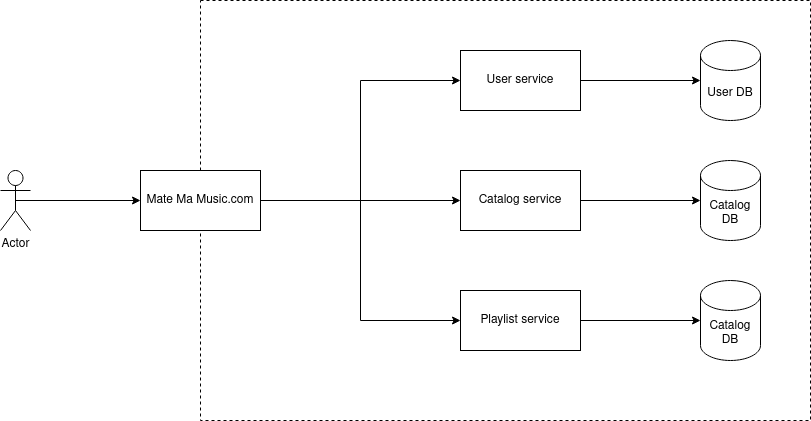

# demo-opentelemetry-forumphp2024

L'idée maîtresse de cette démo est de démontrer à quel point il est simple de mettre en place des traces distribuéesen PHP avec OpenTelemetry.

## Architecture

Comme exemple d'application, nous allons créer une petite architecture orientée service (SOA) avec plusieurs services en PHP/Symfony 7.



Il s'agit d'un site web qui permet à des utilisateurs de créer des listes de leurs films préférés à partir d'un catalogue de films disponibles.

## Pré-requis

* Docker + le plugin docker compose v2
* Bash

## Démarrer l'application

Commencer par construire les images :

```sh
bin/build.sh
```

et démarrer l'application:

```sh
bin/up.sh
```

Quand vous avez fini, pour éteindre les containers et supprimer les volumes :

```sh
bin/down.sh
```
