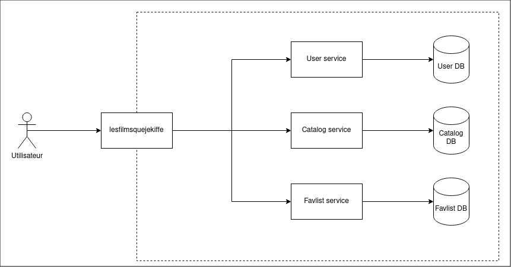

# demo-opentelemetry-php

The main idea of this demo is to show how simple it is to setup distributed tracing in PHP with OpenTelemetry.

## Architecture

As an example of application, we will create a small service-oriented architecture with several PHP/Symfony 7 services.



It is a small website allowing users to register and create some playlists from the available music catalog.

## Start the environment

First build the images:

```sh
bin/build.sh
```

And start the application:

```sh
bin/up.sh
```

If you want to clean things up, you can remove all the containers and volumes by running:

```sh
bin/down.sh
```
